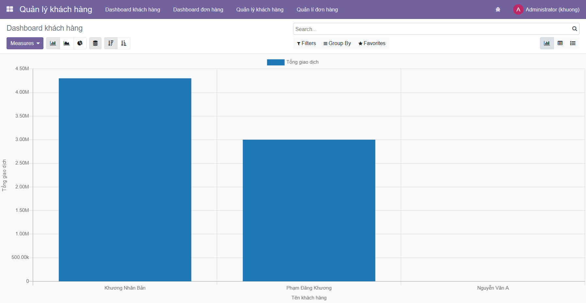
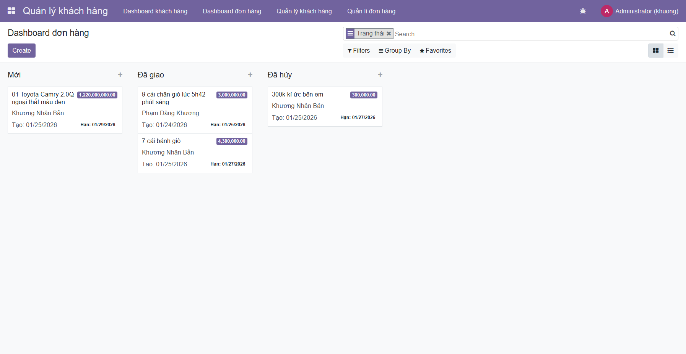
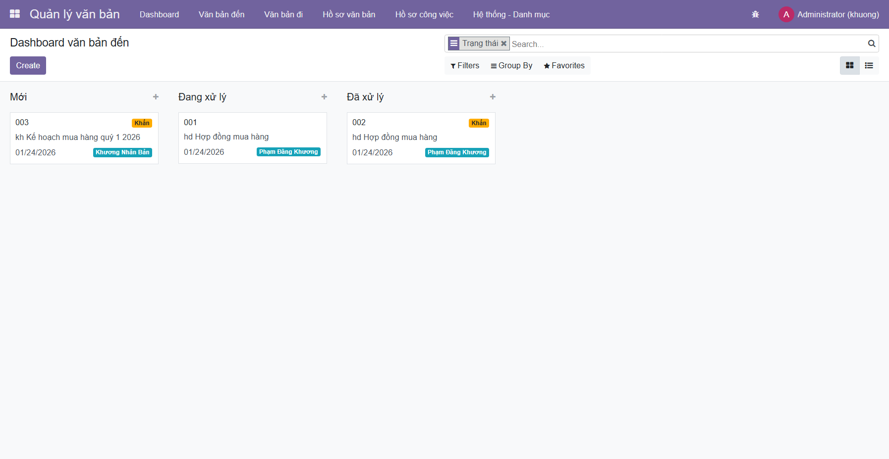
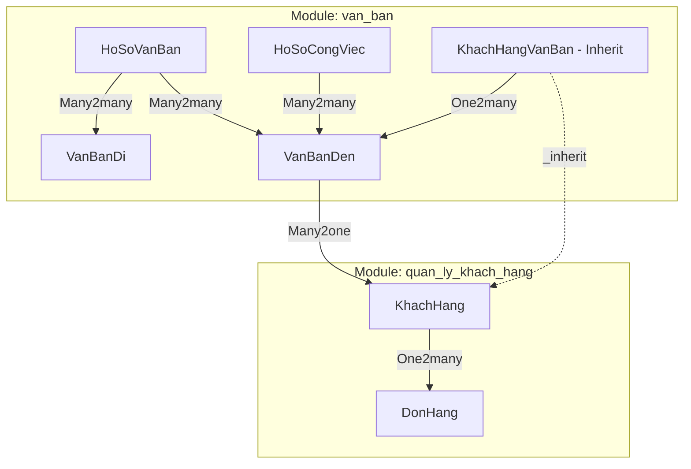
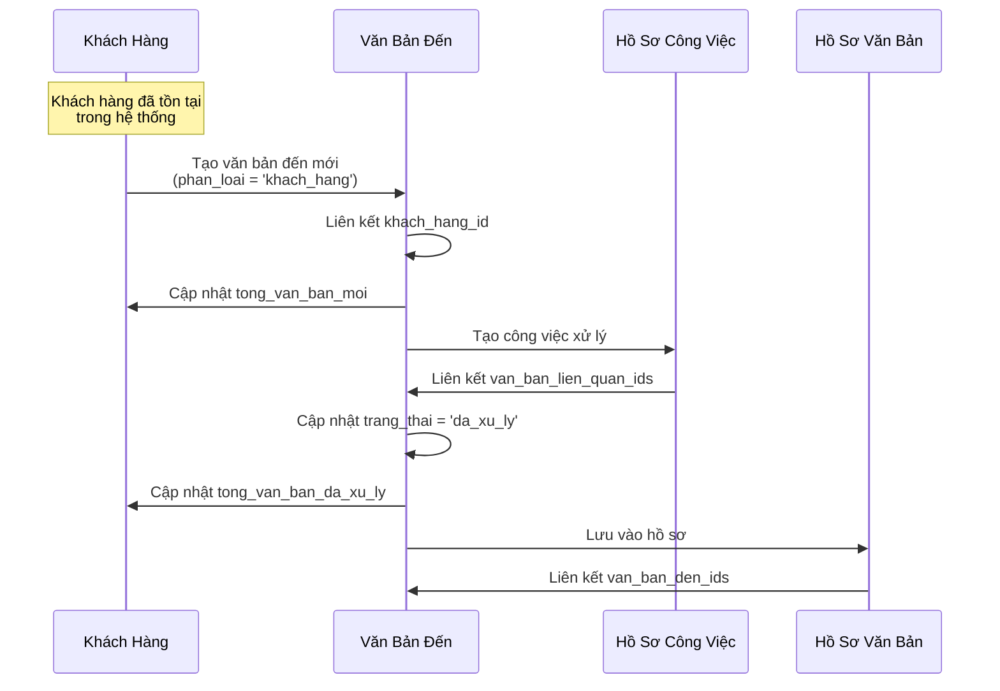
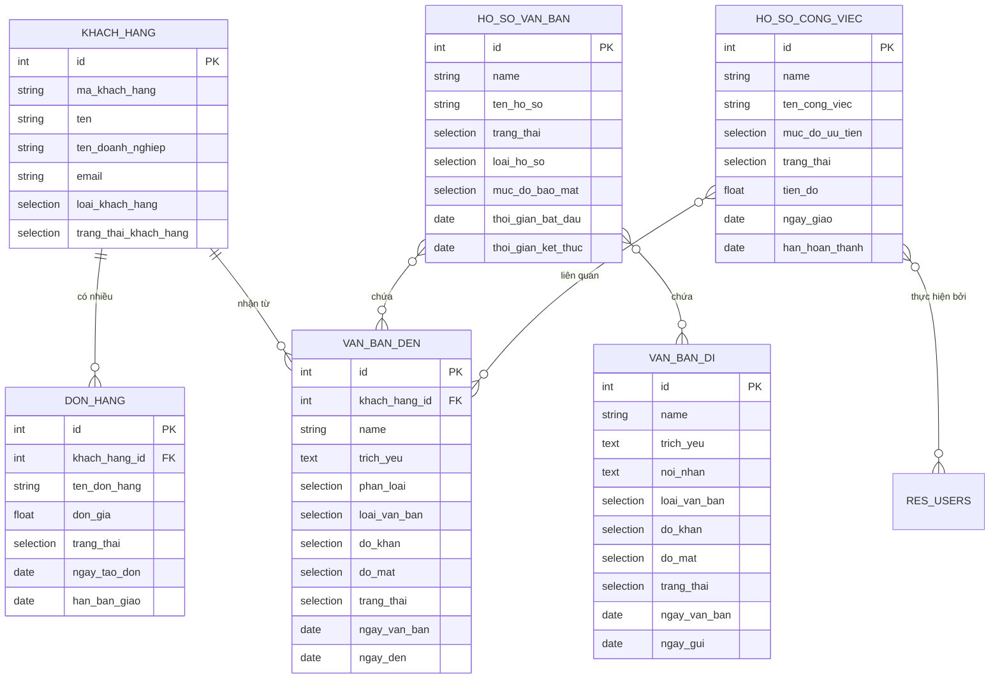

<h2 align="center">
    <a href="https://dainam.edu.vn/vi/khoa-cong-nghe-thong-tin">
    🎓 Faculty of Information Technology (DaiNam University)
    </a>
</h2>
<h2 align="center">
    PLATFORM ERP
</h2>
<div align="center">
    <p align="center">
        
        
        
    </p>

[](https://www.facebook.com/DNUAIoTLab)
[](https://dainam.edu.vn/vi/khoa-cong-nghe-thong-tin)
[](https://dainam.edu.vn)

</div>


---

## 1. Tổng Quan Hệ Thống

Hệ thống bao gồm hai module Odoo 15 tùy chỉnh hoạt động phối hợp với nhau:

| Module | Mô Tả | Phụ Thuộc |
|--------|-------|-----------|
| `quan_ly_khach_hang` | Quản lý thông tin khách hàng và đơn hàng | `base` |
| `van_ban` | Quản lý văn bản đến/đi, hồ sơ công việc | `base`, `quan_ly_khach_hang` |

> [!IMPORTANT]
> Module `van_ban` phụ thuộc vào `quan_ly_khach_hang`, nghĩa là `quan_ly_khach_hang` phải được cài đặt trước khi cài đặt `van_ban`.

### 1.1. Tóm Tắt Chức Năng Module

#### Module `quan_ly_khach_hang`

Module cung cấp giải pháp quản lý khách hàng và đơn hàng toàn diện:

| Chức Năng | Mô Tả |
|-----------|-------|
| **Quản lý thông tin khách hàng** | Lưu trữ thông tin cá nhân/doanh nghiệp, phân loại khách hàng mới/cũ |
| **Tự động sinh mã khách hàng** | Tạo mã từ tên và tên doanh nghiệp, hỗ trợ nhập tay |
| **Quản lý đơn hàng** | Theo dõi vòng đời đơn hàng: Mới → Đã giao / Đã hủy |
| **Thống kê tự động** | Computed fields tính tổng đơn theo trạng thái, tổng giao dịch |
| **Dashboard khách hàng** | Biểu đồ (Graph) và bảng phân tích (Pivot) thống kê khách hàng |
| **Dashboard đơn hàng** | Kanban board theo dõi đơn hàng theo trạng thái, hỗ trợ kéo thả |
| **Bộ lọc nâng cao** | Tìm kiếm theo loại khách hàng, trạng thái; nhóm theo tiêu chí |

#### Module `van_ban`

Module quản lý văn bản hành chính và công việc:

| Chức Năng | Mô Tả |
|-----------|-------|
| **Văn bản đến** | Tiếp nhận, phân loại (nội bộ/khách hàng), theo dõi xử lý |
| **Văn bản đi** | Soạn thảo, phê duyệt, gửi đi theo quy trình |
| **Hồ sơ văn bản** | Lưu trữ, phân loại văn bản theo hồ sơ |
| **Hồ sơ công việc** | Giao việc, theo dõi tiến độ, đánh giá kết quả |
| **Dashboard văn bản** | Kanban board theo dõi văn bản theo trạng thái, hiển thị độ khẩn |
| **Liên kết khách hàng** | Gắn văn bản với khách hàng, thống kê văn bản theo khách |
| **Hệ thống danh mục** | Quản lý đơn vị, chức vụ, loại văn bản, độ mật, độ khẩn |

---

## 2. Module 1: quan_ly_khach_hang

### 2.1. Thông Tin Module

| Thuộc Tính | Giá Trị |
|------------|---------|
| **Tên kỹ thuật** | `quan_ly_khach_hang` |
| **Tên hiển thị** | Quản lý khách hàng |
| **Phiên bản** | 0.1 |

**Cấu trúc thư mục:**
```
quan_ly_khach_hang/
├── __init__.py
├── __manifest__.py
├── models/
│   ├── __init__.py
│   ├── khach_hang.py      # Model khách hàng
│   └── don_hang.py        # Model đơn hàng
├── security/
│   ├── security.xml
│   └── ir.model.access.csv
└── views/
    ├── khach_hang_views.xml
    ├── don_hang_views.xml
    └── menu_views.xml
```

---

### 2.2. Model: KhachHang

**Tên kỹ thuật:** `quan_ly_khach_hang.khach_hang`  
**Mô tả:** Lưu trữ thông tin khách hàng và các chỉ số tổng hợp đơn hàng


### 2.4. Giao Diện Người Dùng

#### 2.4.1. Dashboard Khách Hàng



> [!NOTE]
> Các computed fields được đánh dấu `store=True`, nghĩa là giá trị sẽ được lưu vào database và tự động cập nhật khi các trường phụ thuộc thay đổi.

---

### 2.3. Model: DonHang

**Tên kỹ thuật:** `quan_ly_khach_hang.don_hang`  
**Mô tả:** Lưu trữ thông tin đơn hàng của khách hàng


---


#### 2.4.2. Dashboard Đơn Hàng



Dashboard cung cấp các view phân tích:

| View | Mô Tả |
|------|-------|
| **Graph View** | Biểu đồ cột thống kê tổng giao dịch và số đơn đã giao theo khách hàng |
| **Pivot View** | Bảng phân tích đa chiều: loại khách hàng (hàng), trạng thái (cột), các chỉ số (tổng giao dịch, số đơn) |

**Menu truy cập:** Quản lý khách hàng → Dashboard khách hàng


Dashboard sử dụng Kanban board với các tính năng:

- **Nhóm theo trạng thái:** Các cột Mới, Đã giao, Đã hủy
- **Kanban Card:** Hiển thị tên đơn, đơn giá, tên khách hàng, ngày tạo, hạn bàn giao
- **Kéo thả:** Di chuyển đơn hàng giữa các trạng thái

**Menu truy cập:** Quản lý khách hàng → Dashboard đơn hàng

---

## 3. Module 2: van_ban

### 3.1. Thông Tin Module

| Thuộc Tính | Giá Trị |
|------------|---------|
| **Tên kỹ thuật** | `van_ban` |
| **Tên hiển thị** | Quản lý văn bản |
| **Phiên bản** | 0.1 |
| **Phụ thuộc** | `base`, `quan_ly_khach_hang` |

**Tác giả:**  [:octocat:github](https://github.com/tranhuan123/TTDN-15-01-N1)
Các thông tin chi tiết về Module Quản lý văn bản (van_ban) vui lòng xem lại  [:octocat:github](https://github.com/tranhuan123/TTDN-15-01-N1)

**Cấu trúc thư mục sau cải tiến:**
```
van_ban/
├── __init__.py
├── __manifest__.py              # Đã thêm dependency quan_ly_khach_hang
├── models/
│   ├── __init__.py              # Đã thêm import khach_hang_van_ban
│   ├── van_ban_den.py           # Đã thêm phan_loai, khach_hang_id, group_expand
│   ├── van_ban_di.py
│   ├── ho_so_van_ban.py
│   ├── ho_so_cong_viec.py
│   ├── danh_muc.py
│   └── khach_hang_van_ban.py    # [MỚI] Mở rộng model KhachHang
├── security/
│   ├── security.xml
│   └── ir.model.access.csv
└── views/
    ├── van_ban_den_views.xml    # Đã thêm Kanban view, Dashboard action
    ├── van_ban_di_views.xml
    ├── ho_so_van_ban_views.xml
    ├── ho_so_cong_viec_views.xml
    ├── danh_muc_views.xml
    ├── khach_hang_views.xml     # [MỚI] View inheritance cho KhachHang
    └── menu_views.xml           # Đã thêm menu Dashboard
```

---

### 3.2. Các Cải Tiến Chính

Nhóm đã thực hiện các cải tiến sau đây cho module `van_ban`:

| STT | Cải Tiến | Mô Tả |
|-----|----------|-------|
| 1 | Tích hợp khách hàng | Liên kết văn bản đến với khách hàng từ module `quan_ly_khach_hang` |
| 2 | Mở rộng model khách hàng | Thêm thống kê văn bản vào form khách hàng |
| 3 | Dashboard Kanban | Theo dõi văn bản theo trạng thái với giao diện kéo thả |
| 4 | Cải tiến Search View | Bộ lọc và nhóm nâng cao cho văn bản đến |

---

#### 3.2.1. Tích Hợp Khách Hàng

**Files thay đổi:** `models/van_ban_den.py`, `views/van_ban_den_views.xml`

Cải tiến bổ sung khả năng phân loại và liên kết văn bản đến với khách hàng:

| Field | Kiểu Dữ Liệu | Mô Tả |
|-------|--------------|-------|
| `phan_loai` | Selection | Phân loại văn bản: `noi_bo` (Nội bộ), `khach_hang` (Khách hàng) |
| `khach_hang_id` | Many2one | Liên kết đến `quan_ly_khach_hang.khach_hang` |

**Đặc điểm triển khai:**
- Field `khach_hang_id` chỉ hiển thị khi `phan_loai = 'khach_hang'`
- Field `khach_hang_id` bắt buộc nhập khi chọn phân loại "Khách hàng"
- Sử dụng `attrs` trong view XML để điều khiển hiển thị động

---

#### 3.2.2. Mở Rộng Model Khách Hàng

**Files mới:** `models/khach_hang_van_ban.py`, `views/khach_hang_views.xml`

Sử dụng kỹ thuật **Model Inheritance** (`_inherit`) để mở rộng model `KhachHang` mà không sửa đổi code gốc:

| Field | Kiểu Dữ Liệu | Mô Tả |
|-------|--------------|-------|
| `van_ban_den_ids` | One2many | Danh sách văn bản đến liên quan đến khách hàng |
| `tong_van_ban_moi` | Integer (computed) | Số văn bản có trạng thái "Mới" |
| `tong_van_ban_dang_xu_ly` | Integer (computed) | Số văn bản có trạng thái "Đang xử lý" |
| `tong_van_ban_da_xu_ly` | Integer (computed) | Số văn bản có trạng thái "Đã xử lý" |

**Cải tiến giao diện:**
- Thêm nhóm "Tổng hợp văn bản" trong form khách hàng
- Thêm tab "Văn bản đến" hiển thị danh sách văn bản liên quan
- Sử dụng **View Inheritance** với xpath để mở rộng view gốc

---

#### 3.2.3. Dashboard Kanban

**Files thay đổi:** `models/van_ban_den.py`, `views/van_ban_den_views.xml`, `views/menu_views.xml`

Dashboard cung cấp giao diện Kanban trực quan để theo dõi văn bản theo trạng thái:

| Tính Năng | Mô Tả |
|-----------|-------|
| **Nhóm theo trạng thái** | Các cột: Mới → Đang xử lý → Đã xử lý |
| **Kéo thả** | Di chuyển văn bản giữa các trạng thái bằng thao tác kéo thả |
| **Cột luôn hiển thị** | Sử dụng `group_expand` để hiển thị tất cả cột dù không có dữ liệu |
| **Badge độ khẩn** | Hiển thị badge màu vàng (Khẩn), đỏ (Hỏa tốc) |
| **Thông tin khách hàng** | Hiển thị tên khách hàng nếu văn bản từ khách hàng |

**Triển khai kỹ thuật:**
- Thêm tham số `group_expand='_expand_trang_thai'` vào field `trang_thai`
- Tạo method `_expand_trang_thai()` trả về tất cả giá trị selection
- Tạo action `action_van_ban_den_dashboard` với `view_mode` là `kanban,tree,form`

---

#### 3.2.4. Cải Tiến Search View

**Files thay đổi:** `views/van_ban_den_views.xml`

Bổ sung các bộ lọc và nhóm mới cho Search View:

| Loại | Tên | Domain/Context |
|------|-----|----------------|
| **Filter** | Mới | `[('trang_thai', '=', 'moi')]` |
| **Filter** | Đang xử lý | `[('trang_thai', '=', 'dang_xu_ly')]` |
| **Filter** | Đã xử lý | `[('trang_thai', '=', 'da_xu_ly')]` |
| **Filter** | Nội bộ | `[('phan_loai', '=', 'noi_bo')]` |
| **Filter** | Khách hàng | `[('phan_loai', '=', 'khach_hang')]` |
| **Group By** | Trạng thái | `{'group_by': 'trang_thai'}` |
| **Group By** | Loại văn bản | `{'group_by': 'loai_van_ban'}` |
| **Group By** | Độ khẩn | `{'group_by': 'do_khan'}` |
| **Group By** | Phân loại | `{'group_by': 'phan_loai'}` |

**Bổ sung field tìm kiếm:** `khach_hang_id`

---

### 3.7. Giao Diện Người Dùng

#### 3.7.1. Dashboard Văn Bản Đến



Dashboard sử dụng Kanban board với các tính năng nổi bật:

| Tính Năng | Mô Tả |
|-----------|-------|
| **Nhóm theo trạng thái** | Các cột: Mới, Đang xử lý, Đã xử lý |
| **Badge độ khẩn** | Hiển thị badge màu vàng (Khẩn), đỏ (Hỏa tốc) |
| **Thông tin khách hàng** | Hiển thị tên khách hàng nếu văn bản từ khách hàng |
| **Kanban Card** | Số văn bản, trích yếu, ngày đến |

**Menu truy cập:** Quản lý văn bản → Dashboard

```xml
<!-- Kanban template với badge độ khẩn -->
<span t-if="record.do_khan.raw_value == 'khan'" class="badge badge-warning">Khẩn</span>
<span t-if="record.do_khan.raw_value == 'hoa_toc'" class="badge badge-danger">Hỏa tốc</span>
```

#### 3.7.2. View Form Văn Bản Đến

View form có logic điều kiện hiển thị:

```xml
<field name="phan_loai" widget="radio"/>
<field name="khach_hang_id" 
       attrs="{
           'invisible': [('phan_loai', '!=', 'khach_hang')], 
           'required': [('phan_loai', '=', 'khach_hang')]
       }"/>
```

> [!NOTE]
> Field `khach_hang_id` chỉ hiển thị và bắt buộc khi `phan_loai` = `'khach_hang'`. Đây là cách Odoo xử lý UI động dựa trên giá trị field.

#### 3.7.3. Search View với Filters

**Văn bản đến:**
| Filter | Domain |
|--------|--------|
| Mới | `[('trang_thai', '=', 'moi')]` |
| Đang xử lý | `[('trang_thai', '=', 'dang_xu_ly')]` |
| Đã xử lý | `[('trang_thai', '=', 'da_xu_ly')]` |
| Nội bộ | `[('phan_loai', '=', 'noi_bo')]` |
| Khách hàng | `[('phan_loai', '=', 'khach_hang')]` |

**Group By:** Trạng thái, Loại văn bản, Độ khẩn, Phân loại

---

## 4. Phân Tích Tích Hợp Giữa Hai Module

### 4.1. Kiến Trúc Tích Hợp



### 4.2. Quy Trình Nghiệp Vụ

#### Luồng Xử Lý Văn Bản Từ Khách Hàng



### 4.3. Phân Tích Mã Nguồn Tích Hợp

#### 4.3.1. Model Kế Thừa (Inheritance)

File [khach_hang_van_ban.py](file:///wsl.localhost/Ubuntu-22.04/home/khuong/odoo-btl/TTDN-16-02-N8/addons/van_ban/models/khach_hang_van_ban.py) sử dụng **Class Inheritance** để mở rộng model khách hàng:

```python
class KhachHangVanBan(models.Model):
    """Mở rộng model KhachHang để thêm liên kết với văn bản đến"""
    _inherit = 'quan_ly_khach_hang.khach_hang'

    # Thêm One2many field tới văn bản đến
    van_ban_den_ids = fields.One2many(
        'van_ban_den',
        'khach_hang_id',
        string='Văn bản đến'
    )

    # Thêm computed fields thống kê văn bản
    tong_van_ban_moi = fields.Integer(
        string='Tổng văn bản mới',
        compute='_compute_tong_hop_van_ban',
        store=True
    )
    # ... các computed fields khác
```

> [!IMPORTANT]
> **Cách hoạt động của `_inherit`:**
> - Không tạo model mới, mà thêm fields/methods vào model gốc
> - Model `quan_ly_khach_hang.khach_hang` sau khi cài `van_ban` sẽ có thêm các fields từ `KhachHangVanBan`
> - Đây là kỹ thuật quan trọng để module mở rộng chức năng mà không sửa code gốc

#### 4.3.2. Liên Kết Many2one Giữa Modules

Trong [van_ban_den.py](file:///wsl.localhost/Ubuntu-22.04/home/khuong/odoo-btl/TTDN-16-02-N8/addons/van_ban/models/van_ban_den.py):

```python
khach_hang_id = fields.Many2one(
    'quan_ly_khach_hang.khach_hang',  # Tham chiếu tới model ở module khác
    string='Khách hàng'
)
```

**Cơ chế ORM:**
- Odoo ORM tự động tìm model theo tên kỹ thuật
- Yêu cầu module `quan_ly_khach_hang` phải được cài trước (khai báo trong `depends`)
- Tạo foreign key trong database: `van_ban_den.khach_hang_id` → `quan_ly_khach_hang_khach_hang.id`

#### 4.3.3. View Inheritance - Mở Rộng Giao Diện

File [views/khach_hang_views.xml](file:///wsl.localhost/Ubuntu-22.04/home/khuong/odoo-btl/TTDN-16-02-N8/addons/van_ban/views/khach_hang_views.xml) trong module `van_ban` mở rộng form view của khách hàng:

```xml
<record id="view_khach_hang_form_inherit_van_ban" model="ir.ui.view">
    <field name="name">Khách hàng - Form - Văn bản</field>
    <field name="model">quan_ly_khach_hang.khach_hang</field>
    <field name="inherit_id" ref="quan_ly_khach_hang.view_khach_hang_form"/>
    <field name="arch" type="xml">
        <!-- Thêm group Tổng hợp văn bản sau group tong_giao_dich -->
        <xpath expr="//field[@name='tong_giao_dich']/.." position="after">
            <group string="Tổng hợp văn bản">
                <group>
                    <field name="tong_van_ban_moi" readonly="1"/>
                    <field name="tong_van_ban_dang_xu_ly" readonly="1"/>
                    <field name="tong_van_ban_da_xu_ly" readonly="1"/>
                </group>
            </group>
        </xpath>
        
        <!-- Thêm tab Văn bản đến sau tab Đơn hàng -->
        <xpath expr="//field[@name='don_hang_ids']/.." position="after">
            <page string="Văn bản đến">
                <field name="van_ban_den_ids">
                    <tree string="Văn bản đến">
                        <field name="name"/>
                        <field name="trich_yeu"/>
                        <field name="ngay_van_ban"/>
                        <field name="loai_van_ban"/>
                        <field name="trang_thai"/>
                    </tree>
                </field>
            </page>
        </xpath>
    </field>
</record>
```

**Kết quả:** Form khách hàng sau khi cài module `van_ban` sẽ có thêm:
- Nhóm "Tổng hợp văn bản" hiển thị thống kê
- Tab "Văn bản đến" liệt kê các văn bản liên quan

---

## 5. Sơ Đồ Quan Hệ Dữ Liệu

### 5.1. Entity Relationship Diagram



### 5.2. Tổng Kết Các Loại Quan Hệ

| Quan Hệ | Từ Model | Tới Model | Loại | Mô Tả |
|---------|----------|-----------|------|-------|
| `don_hang_ids` | KhachHang | DonHang | One2many | Danh sách đơn hàng của khách |
| `khach_hang_id` | DonHang | KhachHang | Many2one | Đơn hàng thuộc về khách |
| `van_ban_den_ids` | KhachHang | VanBanDen | One2many | Văn bản đến từ khách |
| `khach_hang_id` | VanBanDen | KhachHang | Many2one | Văn bản thuộc về khách |
| `van_ban_den_ids` | HoSoVanBan | VanBanDen | Many2many | Văn bản đến trong hồ sơ |
| `van_ban_di_ids` | HoSoVanBan | VanBanDi | Many2many | Văn bản đi trong hồ sơ |
| `van_ban_lien_quan_ids` | HoSoCongViec | VanBanDen | Many2many | Văn bản liên quan công việc |

## 6. Cài đặt

### 6.1. Cài đặt công cụ, môi trường và các thư viện cần thiết

#### 6.1.1. Tải project.
```
git clone [https://githcom/FIT-DNU/Business-Internship.gitub.](https://github.com/khuong-d4ng/TTDN-16-02-N8.git)
```
#### 6.1.2. Cài đặt các thư viện cần thiết
Người sử dụng thực thi các lệnh sau đề cài đặt các thư viện cần thiết

```
sudo apt-get install libxml2-dev libxslt-dev libldap2-dev libsasl2-dev libssl-dev python3.10-distutils python3.10-dev build-essential libssl-dev libffi-dev zlib1g-dev python3.10-venv libpq-dev
```
#### 6.1.3. Khởi tạo môi trường ảo.
- Khởi tạo môi trường ảo
```
python3.10 -m venv ./venv
```
- Thay đổi trình thông dịch sang môi trường ảo
```
source venv/bin/activate
```
- Chạy requirements.txt để cài đặt tiếp các thư viện được yêu cầu
```
pip3 install -r requirements.txt
```
### 6.2. Setup database

Khởi tạo database trên docker bằng việc thực thi file dockercompose.yml.
```
sudo docker-compose up -d
```
### 6.3. Setup tham số chạy cho hệ thống
Tạo tệp **odoo.conf** có nội dung như sau:
```
[options]
addons_path = addons
db_host = localhost
db_password = odoo
db_user = odoo
db_port = 5431
xmlrpc_port = 8069
```
Có thể kế thừa từ file **odoo.conf.template**
### 6.4. Chạy hệ thống và cài đặt các ứng dụng cần thiết
Lệnh chạy
```
python3 odoo-bin.py -c odoo.conf -u all
```
Người sử dụng truy cập theo đường dẫn _http://localhost:8069/_ để đăng nhập vào hệ thống.

## License
© Nhóm 8 CNTT 16-02
© 2024 AIoTLab, Faculty of Information Technology, DaiNam University. All rights reserved.

> [!IMPORTANT]
> **Vậy là lần cuối đi bên nhau...**  
> Cay đắng nhưng không đau
